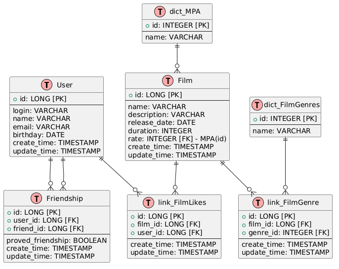

# java-filmorate

## ER-диаграмма



## Комментарии к схеме базы данных

Хотелось бы прокомментировать пару моментов:

- Никто не просил, но я вставил время создания и изменения записей. Это хорошая практика.
- Время создания и изменения записей отсутствует в словарях, так как это излишне.
- `Friendship.proved_friendship` будет принимать значение `true` только для подтверждённых заявок на дружбу.

## Пример SQL-запроса

Запрос, который покажет самый любимый жанр друзей указанного пользователя (например, для пользователя с `id = 1`):

```sql
SELECT
    dfg.id AS genre_id,
    dfg.name AS genre_name,
    COUNT(*) AS likes_count
FROM dict_FilmGenres dfg
INNER JOIN link_FilmGenre lfg ON dfg.id = lfg.genre_id
INNER JOIN link_FilmLikes lfl ON lfg.film_id = lfl.film_id
INNER JOIN Friendship f ON (f.user_id = lfl.user_id OR f.friend_id = lfl.user_id)
WHERE (f.user_id = 1 OR f.friend_id = 1)  -- пользователь с id = 1
    AND f.proved_friendship = true
    AND lfl.user_id != 1  -- исключить самого пользователя
GROUP BY dfg.id, dfg.name
ORDER BY likes_count DESC
LIMIT 1;